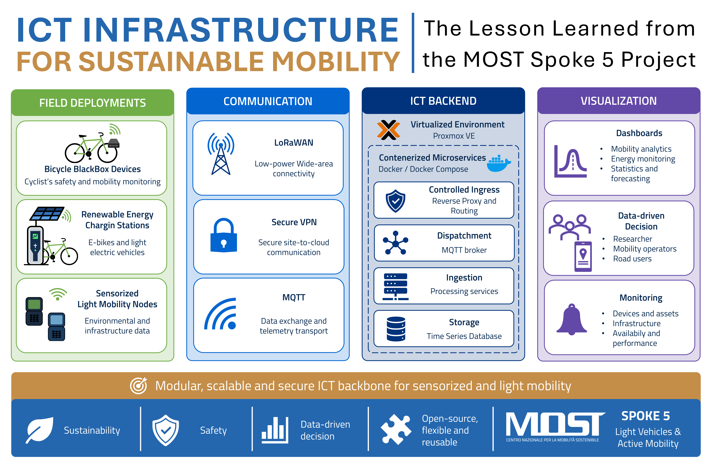

# ICT Infrastructure for Sustainable Mobility: Lessons Learned from MOST Spoke 5

This repository is the central entry point for the ICT architecure related MOST Spoke 5 "*Light Vehicle and Active Mobility*" WP 3 "*Infrastructure & User*".
Moreover this repository is a central reference point for the published article: **ICT Infrastructure for Sustainable Mobility: the Lesson Learned from the MOST Spoke 5 Project**.

## Read the Full Paper

A detailed description of the proposed ICT architecture, its technological foundations, the implemented use cases, and the main lessons learned from the MOST Spoke 5 project is available in the following open-access article:

**ICT Infrastructure for Sustainable Mobility: The Lessons Learned from the MOST Spoke 5 Project**

The paper can be referenced with its DOI: [https://doi.org/10.3390/network6030057](https://doi.org/10.3390/network6030057).
The full version is freely accessible at the publisher website: [https://www.mdpi.com/3994902](https://www.mdpi.com/3994902) 

We invite researchers, practitioners, and stakeholders working in smart mobility, IoT, distributed sensing, and sustainable transportation to read the full article and explore the architecture, implementation choices, and field experience developed within MOST Spoke 5.

### How to Cite

When referring to this repository, the proposed architecture, or the related research activities, please cite:

> Dello Iacono, S.; Franzoni, C.; Bellagente, P.; Flammini, A.; Sisinni, E.
> **ICT Infrastructure for Sustainable Mobility: The Lessons Learned from the MOST Spoke 5 Project.**
> *Network* **2026**, *6*, 57.
> https://doi.org/10.3390/network6030057

### BibTeX

```bibtex
@Article{2026_NETWORK_DelloIacono,
  author  = {{Dello Iacono}, Salvatore and Franzoni, Chiara and Bellagente, Paolo and Flammini, Alessandra and Sisinni, Emiliano},
  title   = {ICT Infrastructure for Sustainable Mobility: The Lessons Learned from the MOST Spoke 5 Project},
  journal = {Network},
  year    = {2026},
  volume  = {6},
  pages   = {57},
  doi     = {10.3390/network6030057},
  url     = {https://www.mdpi.com/3994902}
}
```

## Graphical Abstract




## Project Scope

The article presents the ICT backbone developed in the MOST Spoke 5 project for sustainable and sensorized light mobility. The proposed infrastructure combines distributed sensing, low-power communications, secure networking, containerized services, time-series storage, dashboarding, and infrastructure monitoring to support heterogeneous field deployments.

The paper focuses on a reusable backend architecture for collecting, processing, storing, and visualizing data from light-mobility systems. The architecture is designed to support real-world experimental deployments, including:

- bicycle-mounted BlackBox devices for cyclist safety and mobility monitoring;
- renewable-energy charging stations for e-bikes and light electric vehicles;
- LoRaWAN and VPN-protected IP communication paths;
- MQTT-based telemetry ingestion;
- InfluxDB time-series storage;
- Grafana dashboards;
- Prometheus-based infrastructure monitoring;
- containerized deployment and service isolation.

## Companion GitHub projects

1. [MOST ICT Architecture](https://github.com/delloiaconos/most-ict-architecture):
   Docker-based configuration and deployment material for the MOST Spoke 5 ICT architecture used for data collection, integration, processing, and visualization.

2. [MOST Shelly Client Infrastructure](https://github.com/delloiaconos/most-shelly-client):  
   Client-side infrastructure for integrating field devices with secure networking and MQTT-based communication in MOST Spoke 5 deployments.

3. [ICT Monitoring](https://github.com/delloiaconos/ict-monitoring): This repository provides the containerized Prometheus/Grafana monitoring stack used to supervise the health, availability, and performance of the distributed ICT infrastructure developed in MOST Spoke 5.

## Reproducibility notes

The article describes an operational ICT infrastructure rather than a single standalone software package. Reproducibility therefore depends on the deployment/configuration files in the companion GitHub repositories listed above.

The general infrastructure pattern is based on:

- virtualization through Proxmox;
- containerized microservices through Docker and Docker Compose;
- controlled ingress and reverse-proxy routing;
- VPN-secured communication channels;
- LoRaWAN and MQTT telemetry ingestion;
- time-series persistence;
- dashboard-based inspection;
- infrastructure observability and health monitoring.

## Data availability

The field data discussed in the article are subject to project and funding-policy restrictions. 
Access to datasets should be requested from the corresponding authors, where permitted by the applicable project policies.


## Authors and contacts

For scientific questions about the manuscript, contact the corresponding authors:

- Salvatore Dello Iacono, Universita degli Studi di Brescia
- Emiliano Sisinni, Universita degli Studi di Brescia


## Fundings

This study was carried out within the MOST-Sustainable Mobility National Research Center and received funding from the European Union Next-GenerationEU (Piano Nazionale di Ripresa e Resileneza (PNRR) - Missione 4, Componente 2, Investimento 1.4 - D.D. 1033 17/06/2022, CN00000023), Spoke 5 "Light Vehicle and Active Mobility".
